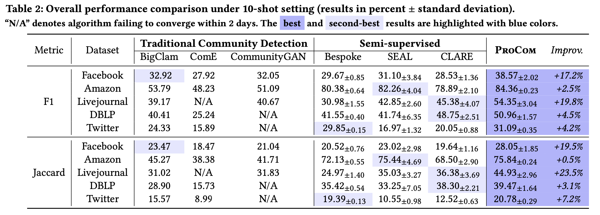

# KDD2024Submission - ProCom

This is the official repo for KDD 2024 Research Track Submission paper ''**ProCom: A Few-shot Targeted Community Detection Algorithm**''.


## Run the Codes

### Repo Introduction
This repo contains the following contents:
```
.
├── README.md
├── ckpts               --- This folder contains pre-trained models for reproducibility 
├── code                --- This folder contains codes of ProCom
│   ├── data.py             (data loading)
│   ├── metrics.py          (evaluation)
│   ├── model.py            (GNN encoder and Prompt layer)
│   ├── pretrain.py         (context-aware pre-training)
│   ├── run.py              (run ProCom pipeline)
│   ├── run_pretrain.py     (run ProCom's pretraining phase)
│   └── utils.py            (utilization functions)
├── data                ---  This folder contaisn 5 experimental datasets
│   ├── amazon
│   ├── dblp
│   ├── facebook
│   ├── lj
│   └── twitter
└── logs                ---  This folder contains several running logs for references
    ├── AMAZON_EXAMPLE.log
    ├── DBLP_EXAMPLE.log
    └── FACEBOOK_EXAMPLE.log
```

### Environmental Requirements

0. Python 3.7 or above
1. Install pytorch with version 1.13.0 or later 
2. Install Pytorch-Geometric (PyG) with version 2.3.1. Please refer to [PyG official website](https://pytorch-geometric.readthedocs.io/en/latest/notes/installation.html) for more information of installing prerequisites.


### Running Scripts

Execute `code/run_pretrain.py` for the pre-training stage and saving the pre-trained model:
```
python run_pretrain.py --dataset=DATASET_NAME 
```

Execute `code/run.py` for the overall ProCom pipeline
```
python run.py --dataset=DATASET_NAME  --run_times=YOUR_RUN_TIMES --subg_scale=PARAMETER_LAMBDA
```

Descriptions of arguments (for more options, please refer to `run.py`)
```
--dataset [facebook, amazon, dblp, twitter, lj]: the dataset to run 
--num_shot: number of prompt communities, default as 10
--num_pred: number of predicted communities
--gnn_type [GCN, GAT, SAGE, GIN, TransformerConv]: gnn encoder type, default as GCN
--hidden_dim: embedding dimention, default as 128
--node_scale: weight of L_{n2c}, default as 1.0
--subg_scale: weight of L_{c2c}, default as 1.0, search fron {0.001, 0.01, 0.1, 1}
```

### Example Logs

We have uploaded some running logs under the `logs` folder for reference.

--- 

## Performance 

### Main Experiments

We conduct the overall performance comparison with both traditional community detection methods (BigClam, ComE, CommunityGAN) and semi-supervised methods (Bespoke, SEAL, CLARE).

For traditional methods, the results are reported from SEAL and CLARE. 
For semi-supervised methods, we run their released codes under 10-shot setting, and parameters are set following the original papers. 

* Bespoke [Official Implementation](https://github.com/abaxi/bespoke-icdm18) | [Faster Reproduced Version](https://github.com/yzhang1918/bespoke-sscd)
* SEAL [Official Implementation](https://github.com/yzhang1918/kdd2020seal)
* CLARE [Official Implementation](https://github.com/FDUDSDE/KDD2022CLARE)


